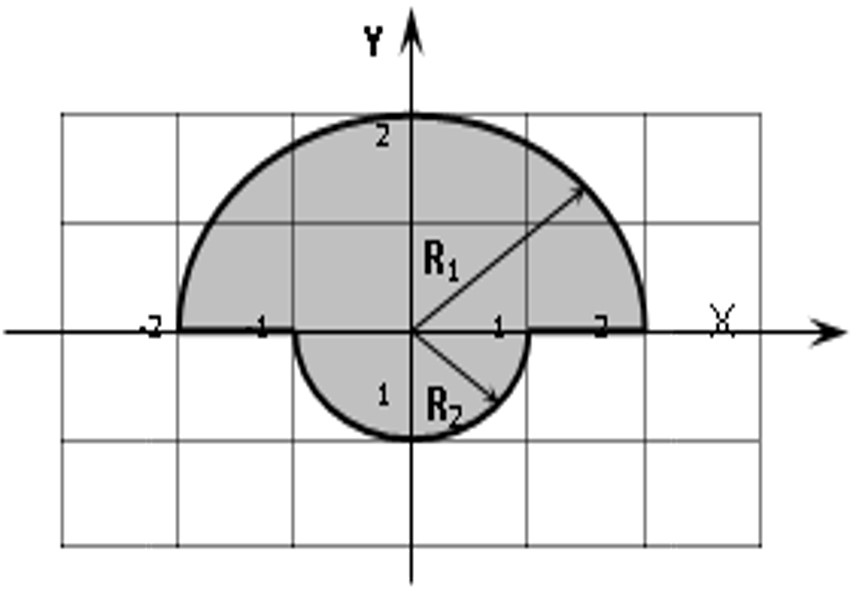

Self 03. Задание 3.

Составить программу, проверяющую попадание точки в заданную область. Область задана на рисунке заштрихованной фигурой. Координаты точки X и Y ввести с клавиатуры. Вывести на экран одно из сообщений: 
о попадании точки во внутрь области;
о попадании точки на границу области;
о не принадлежности точки области.
