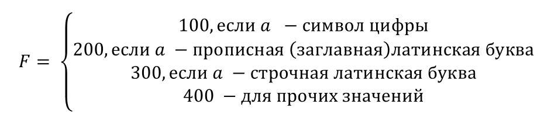

Self 01. Задание 1
На основе проекта консольного приложения, подготовить программу,  вычисляющую значение переменной 𝐹 в зависимости от символа 𝑎 (символ, вводимый пользователем) по правилу:

На экран вывести значение a и F. 
До решения задачи подумайте, какие типы переменных использовать и какие алгоритмические конструкции подходят для решения задачи
