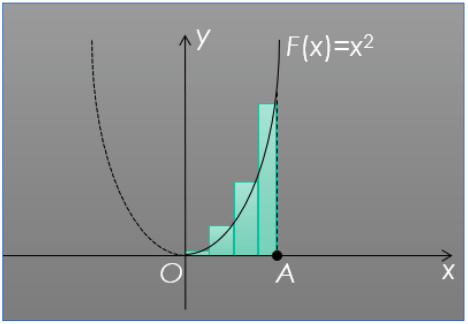

# Self 03. Задача для while

Вычислить приближенно площадь фигуры под графиком функции F(x) = x2 при x ≥ 0. Методом прямоугольников

Граница площадки по Ох – [0; A], точка А и количество интервалов разбиения N > 0 вводятся с клавиатуры пользователем

1. Какие нужны переменные, какие у них типы?
1. Какие ограничения наложены на значения этих переменных?
1. Условие окончания цикла.

