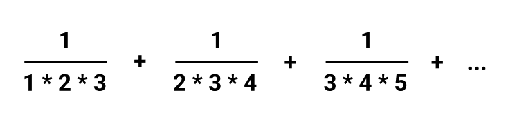

# Self 04. Бесконечная сумма

Реализуйте программу вычисления приближенного значения
бесконечной суммы:

Изучите отличия в реализации для типов **float** и **double**.
В чём состоит различие полученных результатов? Подумайте, а в чём отличие для типа **decimal**?
[Есть ли у decimal epsilon?](https://stackoverflow.com/questions/11781899/c-sharp-decimal-epsilon)