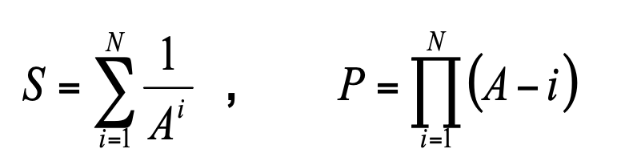

# Self 05

Для заданного натурального числа N и вещественного числа A вычислить и вывести на экран:

Предел суммирования (произведения) **N** и значение **A** ввести с клавиатуры.

Стандартную функцию **pow** не использовать.