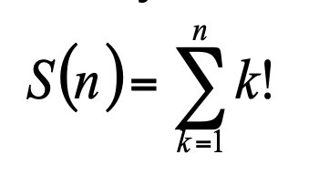

# Self 06

Вычислить и вывести на экран таблицу значений функции одной переменной

Изменение аргумента задано в виде: **начальное значение (шаг) конечное значение** и составляет: n = 5(1)12.

На каждой строке экрана вывести текущее значение аргумента и значение функции.