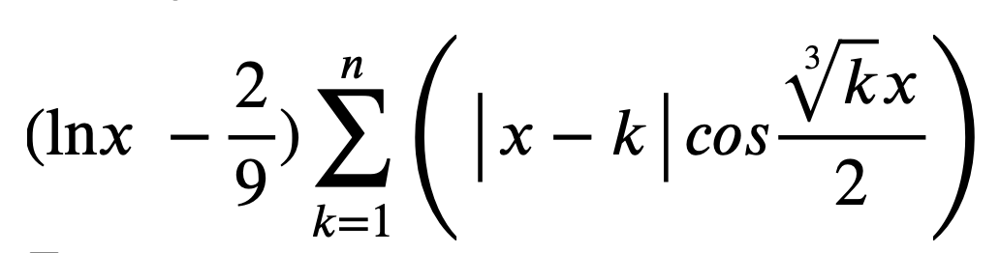

# Self 07

Напишите программу, которая позволяет пользователю ввести с клавиатуры значение вещественной переменной **x** и целочисленной **1 <= n <= 20**. Определить и вывести на экран значение, вычесленное по формуле: 

При некорректных данных выводить строку “Wrong input” и запрашивать повторно ввод корректных значений. После вывода результатов расчёта пользователь может выйти из программы или запросить повторение работы для ввода новых данных. Вывод вещественных значений в консольное окно осуществляется с точностью до трёх знаков после десятичного разделителя.