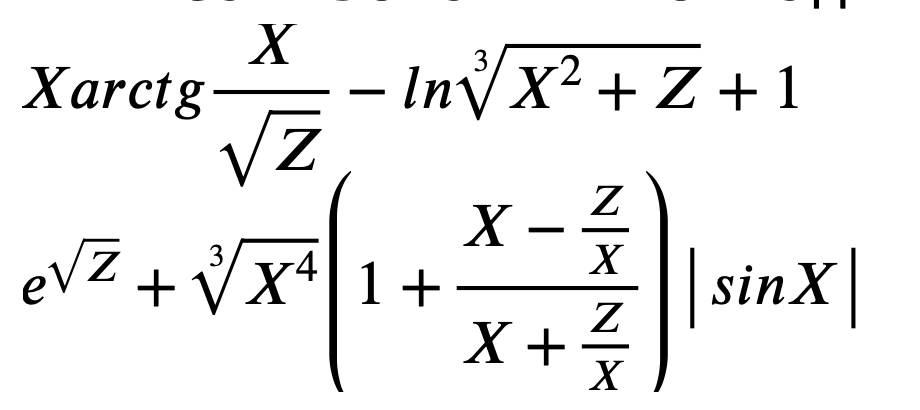

# Self 08

* Составить программу для вычисления таблицы значений функции для **N** значений **X**, изменяющихся от **X0** с шагом **dX** и **M** значений **Z**, меняющихся от **Z0** с шагом **dZ**. **N** > 0, **M** > 0- целые, **X0**, **Z0**, **dX** > 0, **dZ** > 0 - вещественные

* Реализовать и отладить программу для следующих функций:

* Некорректные данные и аварийные ситуации обработать. Предусмотреть цикл повторения решения

* *Дополнительно. Реализовать экранное текстовое меню, позволяющее выбрать функцию, для которой будет построена таблица значений